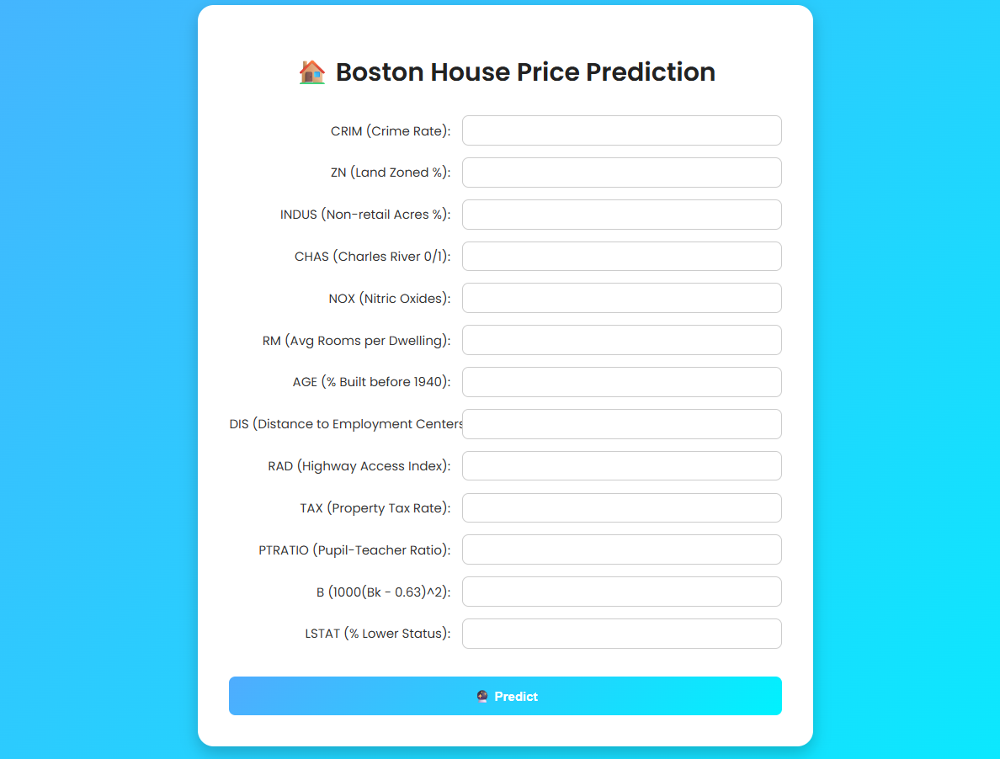

# DETAIL ABOUT THE PROJECT

1. [Github Account](https://github.com)
2. [HerokuAccount](https://heroku.com)
3. [VS Code IDE](https://code.visualstudio.com/)
4. [GitCLI](https://git-scm.com/book/en/v2/Getting-Started-The-Command-Line)

Create a new environment 

'''
conda create -p venv python ==3.7 -y
'''

# 🏠 Boston House Price Prediction App

This is a web application built with **Flask** that predicts housing prices in Boston using a trained **Machine Learning model**. The model is trained on the classic **Boston Housing Dataset**. The app provides an intuitive web interface for users to input various housing-related features and receive price predictions instantly.

## 🔍 Project Overview

- **Model**: Linear Regression (or any other ML model you used)
- **Framework**: Flask (Python-based web framework)
- **Interface**: HTML, CSS (Bootstrap or custom styling)
- **Deployment**: (I will also deploy it on Render for live access to everyone etc.)

The purpose of this project is to demonstrate the end-to-end process of building, training, and deploying a machine learning model with a clean web interface.

---

## 🧠 Machine Learning Model

The model is trained on the **Boston Housing Dataset**, which contains information collected by the U.S Census Service concerning housing in the area of Boston Mass. The features include:

- CRIM: Crime rate by town
- ZN: Proportion of residential land zoned
- INDUS: Proportion of non-retail business acres
- CHAS: Charles River dummy variable
- NOX: Nitric oxides concentration
- RM: Average number of rooms per dwelling
- AGE: Proportion of owner-occupied units built prior to 1940
- DIS: Weighted distances to five Boston employment centers
- RAD: Index of accessibility to radial highways
- TAX: Full-value property tax rate
- PTRATIO: Pupil-teacher ratio
- B: Proportion of African Americans by town
- LSTAT: % lower status of the population

Target: **MEDV** (Median value of owner-occupied homes in $1000s)

---

## 🖥️ Web Application Overview

The Flask-based web interface allows users to:

- Enter the housing features through a user-friendly form
- Submit the data to the backend
- View the predicted house price returned by the model

### 🔧 Tech Stack

- **Frontend**: HTML5, CSS3
- **Backend**: Python, Flask
- **ML Model**: Scikit-learn
- **Deployment**: Not yet deployed but i will deploy this on **Render**

---

## 📸 Screenshots

---

## 🚀 How to Run the Project Locally

1. **Clone the repository**
And run on your system.

